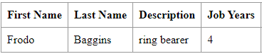
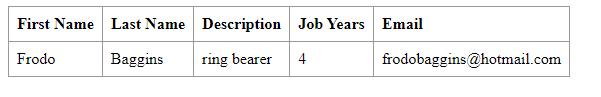

DevOps Technical Report | Class Assignment 1
============================================

Table of Contents
-----------------
1. [Introduction](#introduction)
2. [Part 1 - With Git commands, add a new feature to a React.js and Spring Data REST 
Application using only the master branch](#part-1---with-git-commands-add-a-new-feature-to-a-reactjs-and-spring-data-rest-application-using-only-the-master-branch)
3. [Part 2 - With Git commands, add a new feature to a React.js and Spring Data REST 
Application using branches](#part-2---with-git-commands-add-a-new-feature-to-a-reactjs-and-spring-data-rest-application-using-branches)
4. [Part 3 - With Subversion commands, add a new feature to a React.js and 
Spring Data REST Application using branches](#part-3---part-3---with-subversion-commands-add-a-new-feature-to-a-reactjs-and-spring-data-rest-application-using-branches)
5. [Conclusion](#conclusion)


Introduction
------------
In this assignment, we will go through the process of adding new software features,
fixing bugs, and manage the development process effectively using Git and 
Subversion (SVN) for version control.

The assignment is divided into three parts, each focusing on different aspects of 
software development and version control:

1. **Part 1: Adding Features with Git**
   * We will learn how to add new features to the application using only the master 
   branch in Git.
   * Tasks include setting up the project, version tagging, feature development,
   and final tagging.

2. **Part 2: Feature Development with Git Branches**
   * We will explore the use of Git branches to develop and merge new features and 
   bug fixes. 
   * Tasks include creating feature branches, implementing new features, fixing bugs,
   and merging changes back to the master branch.

3. **Part 3: Version Control with Subversion**
   * We will transition to Subversion (SVN) and repeat the process of adding features
   to the application. 
   * Tasks include repository setup, feature development, version tagging, 
   and conclusion.


Part 1 - With Git commands, add a new feature to a React.js and Spring Data REST Application using only the master branch
---------------------------------------------------------------------------------------------------------------
In the firs part of this report, we will walk through the steps to add a new feature to 
an existing React.js and Spring Data REST application, using Git commands 
only in the main branch (master).
The feature we will add is the ability to record the years of experience 
of employees in the company. We will follow a step-by-step approach to 
analyze, design, and implement this feature.

### Requirements
1. Copy the code of the Tutorial React.js and Spring Data REST Application 
into a new folder named CA1.
2. Commit the changes (and push them).
3. We should use tags to mark the versions of the application. You should use a
pattern like: major.minor.revision (e.g., 1.1.0).
Tag the initial version as **v1.1.0.** Push it to the server.
4. Let's develop a new feature to add a new field to the application. In this case, lets
add a new field to record the years of the employee in the company (e.g., jobYears).
   * You should add support for the new field.
   * You should also add unit tests for testing the creation of Employees 
   and the validation of their attributes (for instance, no null/empty values).
   For the new field, only integer values should be allowed.
   * You should debug the server and client parts of the solution. 
   * When the new feature is completed (and tested) the code should be 
   committed and pushed and a new tag should be created (e.g, **v1.2.0**).
5. At the end of the assignment mark your repository with the tag **ca1-part1**.
6. Use issues in gitHub to track the main tasks.

### Analysis
Before diving into implementation, let's analyze the requirements and identify
the key components and tasks involved:

1. **Initial Setup**: We need to copy the existing codebase into a new folder 
named "CA1" and commit the changes.
2. **Version Tagging**: Tag the initial version as v1.1.0.
3. **New Feature Development**:
   * Add support for a new field named "jobYears" to the Employee entity.
   * Implement unit tests for creating employees and validating their 
   attributes, including the new field.
   * Debug both server and client parts of the solution.
   * Commit and tag the new feature as v1.2.0.
4. **Final Tagging**: Mark the repository with the tag "ca1-part1" at the 
end of the assignment.

### Design
Based on the analysis, we can outline the design for implementing the new feature:

1. **Modify Entity**: Add a new field named "jobYears" to the Employee entity.
2. **Update API**: Modify the REST API to support the new field.
3. **Implement Unit Tests**: Write unit tests to ensure proper creation and 
validation of employees, including the new field.
4. **Debugging**: Identify and fix any issues in both server and client components.
5. **Version Control**: Commit changes and create version tags for tracking.

### Implementation
For previous tasks, not related to this assignment, we have already created
a local directory with the code of the Tutorial React.js and Spring Data REST
Application (C:\Users\user\Documents\TutorialReactSpringApp).

From the analysis, the steps to implement the new feature are as follows:

1. **Initial Setup**:
   * Using the repository created for this purpose,
   copy the code to a new folder named "CA1".
   * Commit the changes and push them to the server.
```bash 
   mkdir ca1
   cp -r c/users/user/Documents/TutorialReactSpringApp/* ca1/
   cd ca1
   git init
   git add .
   git commit -m "first commit"
  ```

2. **Version Tagging**:
   * Tag the initial version as v1.1.0.
```bash
   git tag v1.1.0
   git push origin v1.1.0
  ```
   
3. **New Feature Development**:
* Modify the Employee entity to include a new field named "jobYears".
```java
   @Entity // <1>
   public class Employee {

      private @Id @GeneratedValue Long id; // <2>
      private String firstName;
      private String lastName;
      private String description;
   
      private int jobYears; // New field jobYears added
   
      public Employee(String firstName, String lastName, String description, int jobYears, String email){
        setFirstName(firstName);
        setLastName(lastName);
        setDescription(description);
   
        setJobYears(jobYears); // New method added to set the employee's jobYears
      }

      @Override
      public boolean equals(Object o) {
        if (this == o) return true;
        if (o == null || getClass() != o.getClass()) return false;
        Employee employee = (Employee) o;
        return Objects.equals(id, employee.id) &&
            Objects.equals(firstName, employee.firstName) &&
            Objects.equals(lastName, employee.lastName) &&
            Objects.equals(description, employee.description) &&
   
            jobYears == employee.jobYears;
      }
   
      // getters and setters
   
      public int getJobYears() {
        return jobYears;
      }

      public void setJobYears(int jobYears) {
        if (jobYears < 0)
           throw new IllegalArgumentException("Invalid input");
        this.jobYears = jobYears;
      }
   
      @Override
      public String toString() {
         return "Employee{" + "id=" + id +
            ", firstName='" + firstName + '\'' +
            ", lastName='" + lastName + '\'' +
            ", description='" + description + '\'' +
            ", jobYears='" + jobYears + '\'' +
            '}';
      }
   }
```
   
* Modify the DatabaseLoader component to include the new field 
(set 4 years of experience for the employee Frodo Baggins).
```java
    @Component
    public class DatabaseLoader implements CommandLineRunner { // <2>

        private final EmployeeRepository repository;

        @Autowired // <3>
        public DatabaseLoader(EmployeeRepository repository) {
           this.repository = repository;
        }

        @Override
        public void run(String... strings) throws Exception { // <4>
           this.repository.save(new Employee("Frodo", "Baggins", "ring bearer", 4));
        }
    }
```

* Modify the app.js file to display the new field in the employee list.
```javascript 
   // tag::employee-list[]
   class EmployeeList extends React.Component{
       render() {
          const employees = this.props.employees.map(employee =>
             <Employee key={employee._links.self.href} employee={employee}/>
          );
          return (
             <table>
                <tbody>
                   <tr>
                      <th>First Name</th>
                      <th>Last Name</th>
                      <th>Description</th>
   
                      <th>Job Years</th> // New field added to the table
                   </tr>
                   {employees}
                </tbody>
             </table>
          )
       }
   }
   // end::employee-list[]
   
   // tag::employee[]
   class Employee extends React.Component{
      render() {
         return (
            <tr>
               <td>{this.props.employee.firstName}</td>
               <td>{this.props.employee.lastName}</td>
               <td>{this.props.employee.description}</td>
    
               <td>{this.props.employee.jobYears}</td> // New field added to the table
            </tr>
         )
      }
   }
   // end::employee[]
```

* Implement unit tests for creating employees and validating their attributes.
```java
   public class EmployeeTest {

    /**
     * Test that a valid employee object can be created
     */
    @Test
    public void getValidEmployeeObject() {
        // Arrange
        String firstName = "Frodo";
        String lastName = "Baggins";
        String description = "ring bearer";
        int jobYears = 1;

        // Act
        Employee employee = new Employee(firstName, lastName, description, jobYears);

        // Assert
        assertNotNull(employee);
    }

    /**
     * Test that an invalid employee object with an empty first name throws an exception
     */
    @Test
    public void testInvalidEmployeeObjectWithEmptyFirstName_thenThrowsException() {
        // Arrange
        String firstName = "";
        String lastName = "Baggins";
        String description = "ring bearer";
        int jobYears = 1;

        String expectedMessage = "Invalid input";

        // Act
        Exception exception = assertThrows(IllegalArgumentException.class, () -> {
            new Employee(firstName, lastName, description, jobYears);
        });

        // Assert
        assertEquals(expectedMessage, exception.getMessage());
    }

    /**
     * Test that an invalid employee object with an empty last name throws an exception
     */
    @Test
    public void testInvalidEmployeeObjectWithEmptyLastName_thenThrowsException() {
        // Arrange
        String firstName = "Frodo";
        String lastName = "";
        String description = "ring bearer";
        int jobYears = 1;

        String expectedMessage = "Invalid input";

        // Act
        Exception exception = assertThrows(IllegalArgumentException.class, () -> {
            new Employee(firstName, lastName, description, jobYears);
        });

        // Assert
        assertEquals(expectedMessage, exception.getMessage());
    }

    /**
     * Test that an invalid employee object with an empty description throws an exception
     */
    @Test
    public void testInvalidEmployeeObjectWithEmptyDescription_thenThrowsException() {
        // Arrange
        String firstName = "Frodo";
        String lastName = "Baggins";
        String description = "";
        int jobYears = 1;

        String expectedMessage = "Invalid input";

        // Act
        Exception exception = assertThrows(IllegalArgumentException.class, () -> {
            new Employee(firstName, lastName, description, jobYears);
        });

        // Assert
        assertEquals(expectedMessage, exception.getMessage());
    }

    /**
     * Test that an invalid employee object with a negative job years throws an exception
     */
    @Test
    public void testInvalidEmployeeObjectWithNegativeJobYears_thenThrowsException() {
        // Arrange
        String firstName = "Frodo";
        String lastName = "Baggins";
        String description = "ring bearer";
        int jobYears = -1;

        String expectedMessage = "Invalid input";

        // Act
        Exception exception = assertThrows(IllegalArgumentException.class, () -> {
            new Employee(firstName, lastName, description, jobYears);
        });

        // Assert
        assertEquals(expectedMessage, exception.getMessage());
    }

    /**
     * Test that an invalid employee object with a null first name throws an exception
     */
    @Test
    public void testInvalidEmployeeObjectWithNullFirstName_thenThrowsException() {
        // Arrange
        String firstName = null;
        String lastName = "Baggins";
        String description = "ring bearer";
        int jobYears = 1;


        String expectedMessage = "Invalid input";

        // Act
        Exception exception = assertThrows(IllegalArgumentException.class, () -> {
            new Employee(firstName, lastName, description, jobYears);
        });

        // Assert
        assertEquals(expectedMessage, exception.getMessage());
    }

    /**
     * Test that an invalid employee object with a null last name throws an exception
     */
    @Test
    public void testInvalidEmployeeObjectWithNullLastName_thenThrowsException() {
        // Arrange
        String firstName = "Frodo";
        String lastName = null;
        String description = "ring bearer";
        int jobYears = 1;

        String expectedMessage = "Invalid input";

        // Act
        Exception exception = assertThrows(IllegalArgumentException.class, () -> {
            new Employee(firstName, lastName, description, jobYears);
        });

        // Assert
        assertEquals(expectedMessage, exception.getMessage());
    }

    /**
     * Test that an invalid employee object with a null description throws an exception
     */
    @Test
    public void testInvalidEmployeeObjectWithNullDescription_thenThrowsException() {
        // Arrange
        String firstName = "Frodo";
        String lastName = "Baggins";
        String description = null;
        int jobYears = 1;

        String expectedMessage = "Invalid input";

        // Act
        Exception exception = assertThrows(IllegalArgumentException.class, () -> {
            new Employee(firstName, lastName, description, jobYears);
        });

        // Assert
        assertEquals(expectedMessage, exception.getMessage());
    }
}
```

* After passing the tests, we can run the application from the ca1/basic/ directory
and debug the server and client parts of the solution.
```bash
    cd ca1/basic
    ./mvnw spring-boot:run
```


4. **Commit and tagging**:
* Commit the code changes with the tests and tag the new feature as v1.2.0.
```bash
  git add .
  git commit -m "#1 & #2 - Added jobYears field to Employee constructor and unit tests for constructor with validations"
  git tag v1.2.0
  git push origin v1.2.0
```

5. **Final Tagging**:
* Mark the repository with the tag "ca1-part1" at the end of the assignment.
```bash
  git tag ca1-part1
  git push origin ca1-part1
```


Part 2 - With Git commands, add a new feature to a React.js and Spring Data REST Application using branches
---------------------------------------------------------------------------------------------------------------
In the second part of this report, we will walk through the steps to add a 
new feature to an existing React.js and Spring Data REST application,
using Git commands and branches to manage the development process.
We will be adding an email field to the Employee entity, and then fixing a bug 
related to invalid email addresses.
We will follow a step-by-step approach to analyze, design, and implement
this feature.

### Requirements
1. You should use the master branch to ”publish” the ”stable” versions of the Tutorial
   React.js and Spring Data REST Application.
2. You should develop new features in branches named after the feature. Create a
   branch named ”email-field” to add a new email field to the application. 
   * You should create a branch called email-field.
   * You should add support for the new field.
   * You should also add unit tests for testing the creation of Employees
     and the validation of their attributes (for instance, no null/empty values).
     For the new field, only integer values should be allowed.
   * You should debug the server and client parts of the solution.
   * When the new feature is completed (and tested) the code should be
     merged with the master and a new tag should be created (e.g, **v1.3.0**).
3. You should also create branches for fixing bugs (e.g., ”fix-invalid-email”).
   * Create a branch called fix-invalid-email. The server should only accept Employees with
     a valid email (e.g., an email must have the ”@” sign).
   * You should debug the server and client parts of the solution.
   * When the fix is completed (and tested) the code should be merged into master and a
     new tag should be created (with a change in the minor number, e.g., v1.3.0 -> **v1.3.1**)
4. At the end of the assignment mark your repository with the tag **ca1-part2**.
5. Use issues in gitHub to track the main tasks.

### Analysis
Before diving into implementation, let's analyze the requirements and identify
the key components and tasks involved:

1. **Create a branch for feature development**: Create a branch named "email-field"
to develop and test the new email field feature.
2. **New Feature Development**:
   * Add support for a new field named "email" to the Employee entity.
   * Implement unit tests for creating employees and validating their
     attributes, including the new field.
   * Debug both server and client parts of the solution.
   * Merge and tag the new feature as v1.3.0.
3. **Create a branch for bug fixing**: Create a branch named "fix-invalid-email"
to fix the issue with invalid email addresses.
   * Debug both server and client parts of the solution.
   * Merge and tag the fix as v1.3.1.
4. **Final Tagging**: Mark the repository with the tag "ca1-part2" at the
   end of the assignment.

### Design
Based on the analysis, we can outline the design for implementing the new feature:

1. **Create a branch for feature development**: Create a branch named "email-field"
2. **Modify Entity**: Add a new field named "email" to the Employee entity.
3. **Update API**: Modify the REST API to support the new field.
4. **Implement Unit Tests**: Write unit tests to ensure proper creation and
   validation of employees, including the new field.
5. **Debugging**: Identify and fix any issues in both server and client components.
6. **Version Control**: Merge the feature branch with the master and create
version tags for tracking.
7. **Bug fixing**: Create a branch to fix the issue with invalid email addresses.

### Implementation
From the analysis, the steps to implement the new feature are as follows:

1. **Create a branch for feature development**:
      * Create a branch named "email-field" and switch to it.
```bash
   git checkout -b email-field
```

2. **New Feature Development**:
* Modify the Employee entity to include a new field named "email".
```java
   @Entity // <1>
   public class Employee {

      private @Id @GeneratedValue Long id; // <2>
      private String firstName;
      private String lastName;
      private String description;
      private int jobYears;

      private String email; // New field email added
   
      public Employee(String firstName, String lastName, String description, int jobYears, String email){
        setFirstName(firstName);
        setLastName(lastName);
        setDescription(description);
        setJobYears(jobYears);

        setEmail(email); // New method added to set the employee's email
      }

      @Override
      public boolean equals(Object o) {
        if (this == o) return true;
        if (o == null || getClass() != o.getClass()) return false;
        Employee employee = (Employee) o;
        return Objects.equals(id, employee.id) &&
            Objects.equals(firstName, employee.firstName) &&
            Objects.equals(lastName, employee.lastName) &&
            Objects.equals(description, employee.description) &&
            jobYears == employee.jobYears &&
                
            Objects.equals(email, employee.email);
      }
   
      // getters and setters

      public String getEmail() {
         return email;
      }

      public void setEmail(String email) {
         if (email == null || email.isEmpty())
            throw new IllegalArgumentException("Invalid input");
         
         this.email = email;
      }
   
      @Override
      public String toString() {
         return "Employee{" + "id=" + id +
            ", firstName='" + firstName + '\'' +
            ", lastName='" + lastName + '\'' +
            ", description='" + description + '\'' +
            ", jobYears='" + jobYears + '\'' +
            ", email='" + email + '\'' +
            '}';
      }
   }
```

* Modify the DatabaseLoader component to include the new field
  (set email for the employee Frodo Baggins - frodobaggins@hotmail.com).
```java
    @Component
    public class DatabaseLoader implements CommandLineRunner { // <2>

        private final EmployeeRepository repository;

        @Autowired // <3>
        public DatabaseLoader(EmployeeRepository repository) {
           this.repository = repository;
        }

        @Override
        public void run(String... strings) throws Exception { // <4>
           this.repository.save(new Employee("Frodo", "Baggins", "ring bearer", 4, "frodobaggins@hotmail.com"));
        }
    }
```

* Modify the app.js file to display the new field in the employee list.
```javascript 
   // tag::employee-list[]
   class EmployeeList extends React.Component{
       render() {
          const employees = this.props.employees.map(employee =>
             <Employee key={employee._links.self.href} employee={employee}/>
          );
          return (
             <table>
                <tbody>
                   <tr>
                      <th>First Name</th>
                      <th>Last Name</th>
                      <th>Description</th>
                      <th>Job Years</th> 
                      
                      <th> Email </th> // New field added to the table
                   </tr>
                   {employees}
                </tbody>
             </table>
          )
       }
   }
   // end::employee-list[]
   
   // tag::employee[]
   class Employee extends React.Component{
      render() {
         return (
            <tr>
               <td>{this.props.employee.firstName}</td>
               <td>{this.props.employee.lastName}</td>
               <td>{this.props.employee.description}</td>
               <td>{this.props.employee.jobYears}</td>
               
               <td>{this.props.employee.email}</td> // New field added to the table
            </tr>
         )
      }
   }
   // end::employee[]
```

* Implement unit tests for creating employees and validating their attributes.
```java
   public class EmployeeTest {

    // previous tests    

    /**
    * Test that an invalid employee object with an empty email throws an exception
    */
    @Test
    public void testInvalidEmployeeObjectWithEmptyEmail_thenThrowsException() {
      // Arrange
      String firstName = "Frodo";
      String lastName = "Baggins";
      String description = "ring bearer";
      int jobYears = -1;
      String email = "";

      String expectedMessage = "Invalid input";

      // Act
      Exception exception = assertThrows(IllegalArgumentException.class, () -> {
         new Employee(firstName, lastName, description, jobYears, email);
      });

      // Assert
      assertEquals(expectedMessage, exception.getMessage());
    }

    /**
    * Test that an invalid employee object with a null email throws an exception
    */
    @Test
    public void testInvalidEmployeeObjectWithNullEmail_thenThrowsException() {
      // Arrange
      String firstName = "Frodo";
      String lastName = "Baggins";
      String description = "ring bearer";
      int jobYears = 1;
      String email = null;

      String expectedMessage = "Invalid input";

      // Act
      Exception exception = assertThrows(IllegalArgumentException.class, () -> {
         new Employee(firstName, lastName, description, jobYears, email);
      });

      // Assert
      assertEquals(expectedMessage, exception.getMessage());
    }
}
```

* After passing the tests, we can run the application from the ca1/basic/ directory
  and debug the server and client parts of the solution.
```bash
    cd ca1/basic
    ./mvnw spring-boot:run
```


* Commit changes and linking them to an issue. Merge and tagging the new version as v1.3.0
```bash
  # Commit changes in the email-field branch
  git add .
  git commit -m "#4 and #5 - added email feature to Employee and respective tests"
  
  # Switch to master branch and merge the email-field branch
  git checkout master
  git merge email-field
  
  # Add a tag for the new version
  git tag v1.3.0
  git push origin v1.3.0
```

3. **Create a branch for bug fixing**:
   * Create a branch named "fix-invalid-email" and switch to it.
```bash
   git checkout -b fix-invalid-email
```

* Modify the setEmail() method in the Employee entity to validate the email format.
```java
   @Entity // <1>
   public class Employee {

      private @Id @GeneratedValue Long id; // <2>
      private String firstName;
      private String lastName;
      private String description;
      private int jobYears;
      private String email;
   
      public Employee(String firstName, String lastName, String description, int jobYears, String email){
        setFirstName(firstName);
        setLastName(lastName);
        setDescription(description);
        setJobYears(jobYears);
        setEmail(email); 
      }

      @Override
      public boolean equals(Object o) {
        if (this == o) return true;
        if (o == null || getClass() != o.getClass()) return false;
        Employee employee = (Employee) o;
        return Objects.equals(id, employee.id) &&
            Objects.equals(firstName, employee.firstName) &&
            Objects.equals(lastName, employee.lastName) &&
            Objects.equals(description, employee.description) &&
            jobYears == employee.jobYears &&
            Objects.equals(email, employee.email);
      }
   
      // getters and setters

      public String getEmail() {
         return email;
      }

      public void setEmail(String email) {
         if (email == null || email.isEmpty())
            throw new IllegalArgumentException("Invalid input");

         String emailRegex = "^[a-zA-Z0-9._%+-]+@[a-zA-Z0-9.-]+\\.[a-zA-Z]{2,6}$";
         Pattern pattern = Pattern.compile(emailRegex);
         Matcher matcher = pattern.matcher(email);

         if (!matcher.matches()) {
            throw new IllegalArgumentException("Invalid email format");
         }
         
         this.email = email;
      }
   
      @Override
      public String toString() {
         return "Employee{" + "id=" + id +
            ", firstName='" + firstName + '\'' +
            ", lastName='" + lastName + '\'' +
            ", description='" + description + '\'' +
            ", jobYears='" + jobYears + '\'' +
            ", email='" + email + '\'' +
            '}';
      }
   }
```

* Implement unit tests for validating the email format.
```java
   public class EmployeeTest {
    
    // previous tests

   /**
    * Test that an invalid employee object with an invalid email throws an exception
    */
   @Test
   public void testInvalidEmployeeObjectWithInvalidEmail_thenThrowsException() {
      // Arrange
      String firstName = "Frodo";
      String lastName = "Baggins";
      String description = "ring bearer";
      int jobYears = 2;
      String email = "frodo.bagginsgmail.com";

      String expectedMessage = "Invalid email format";

      // Act
      Exception exception = assertThrows(IllegalArgumentException.class, () -> {
         new Employee(firstName, lastName, description, jobYears, email);
      });

      // Assert
      assertEquals(expectedMessage, exception.getMessage());
   }
}
```

* Commit changes and linking them to an issue. Merge and tagging the new version as v1.3.1
```bash
  # Commit changes in the fix-invalid-email branch
  git add .
  git commit -m "#6 - fixed invalid email validations and respective tests"
  
  # Switch to master branch and merge the fix-invalid-email branch
  git checkout master
  git merge fix-invalid-email
  
  # Add a tag for the new version
  git tag v1.3.1
  git push origin v1.3.1
```

4. **Final Tagging**:
* Mark the repository with the tag "ca1-part2" at the end of the assignment.
```bash
  git tag ca1-part2
  git push origin ca1-part1
```


Part 3 - Part 3 - With Subversion commands, add a new feature to a React.js and Spring Data REST Application using branches
-----------------------------------------------------------------------------------------------------------------------------------------------------------
In the third part of this report, we will outline the process of adding a new feature
to an existing React.js and Spring Data REST application using Subversion (SVN) for 
version control, as an alternative to Git, with branches for development and integration.
We will be introducing the feature to record the years of experience of employees 
in the company. We will follow a structured approach to analyze, design, and implement 
this feature.

### Requirements
1. Set up a new repository for the project named "CA1" in Subversion.
2. Import the existing codebase of the React.js and Spring Data REST application into the repository.
3. Implement version tagging using a pattern like: major.minor.revision (e.g., 1.1.0).
    * Tag the initial version as v1.1.0.
4. Develop the new feature in a feature branch named "years-of-experience".
    * Add support for the new field named "jobYears" to the Employee entity.
    * Include unit tests for creating employees and validating their attributes, ensuring only integer values are allowed for the new field.
    * Debug both server and client components.
    * After completion and testing, merge the feature branch back to the trunk and create a new tag, such as v1.2.0.
5. Mark the repository with the tag "ca1-part3" at the end of the assignment.
6. Utilize issue tracking in Subversion to manage tasks and updates.

### Analysis
Before proceeding with implementation, let's analyze the requirements and identify the key components and tasks involved:

1. **Repository Setup**: Create a new repository and import the existing codebase.
2. **Version Tagging**: Tag the initial version as v1.1.0.
3. **New Feature Development**:
   * Create a feature branch named "years-of-experience".
   * Implement the new field "jobYears" in the Employee entity.
   * Write unit tests to validate employee creation and attribute validation.
   * Debug server and client components.
   * Merge the feature branch to the trunk and tag the new version as v1.2.0.
4. **Final Tagging**: Tag the repository as "ca1-part3" at the conclusion of the assignment.

### Design
Based on the analysis, here's the design for implementing the new feature:

1. **Create Feature Branch**: Establish a feature branch named "years-of-experience".
2. **Modify Entity**: Introduce the "jobYears" field to the Employee entity.
3. **Unit Testing**: Develop unit tests to ensure proper functionality and validation 
of the new field.
4. **Debugging**: Address any issues found in both server and client components.
5. **Merge to Trunk**: Merge the feature branch into the trunk once development and 
testing are complete.
6. **Version Tagging**: Tag the merged trunk as v1.2.0 to mark the completion of the 
new feature.
7. **Final Tagging**: Tag the repository as "ca1-part3" to signify the completion of 
the assignment.

This structured approach ensures systematic development and integration of the 
new feature while maintaining version control and tracking progress effectively 
using Subversion.

### Implementation
From the analysis, the steps to implement the new feature are as follows:

1. **Repository Setup**:
   * Create a new repository named "ca1" in Subversion.
   * Import the existing codebase of the React.js and Spring Data REST application 
   into the repository.
```bash
   svnadmin create ca1
   svn import c/users/user/Documents/TutorialReactSpringApp/ ca1 -m "Initial import"
```

2. **Version Tagging**:
   * Tag the initial version as v1.1.0.
```bash
   svn copy ^/trunk ^/tags/v1.1.0 -m "Tagging initial version as v1.1.0"
```

3. **New Feature Development**:
    * Create a feature branch named "years-of-experience".
    * Switch the new branch and implement the new feature.
 ```bash
    svn copy ^/trunk ^/branches/years-of-experience -m "Creating feature branch for years-of-experience"
    svn switch ^/branches/years-of-experience
 ```
The remaining steps for modifying the entity, implementing unit tests, and debugging, 
are the same as in Part 1 of this report, so they won't be represented here.

4. **Merge to Trunk and tagging**:
   * Once the feature development is complete and tested, merge the feature branch 
   to the trunk.
```bash
   # Switch to the trunk to merge the feature branch
   svn switch ^/trunk
   svn merge ^/branches/years-of-experience
   svn commit -m "Merged years-of-experience feature branch to trunk"
   
    # Tag the new version
   svn copy ^/trunk ^/tags/v1.2.0 -m "Tagging new version as v1.2.0"
```

5. **Final Tagging**:
   * Mark the repository with the tag "ca1-part3" at the end of the assignment.
```bash
   svn copy ^/trunk ^/tags/ca1-part3 -m "Tagging repository as ca1-part3"
```

Conclusion
-----------
In this report, we have detailed the process of adding new features to an existing 
React.js and Spring Data REST application using both Git and Subversion for version 
control. Through three parts, we analyzed, designed, and implemented the addition of 
features such as recording employee years of experience and email fields, as well as 
addressing bugs related to invalid email addresses.

Both Git and Subversion offer powerful version control capabilities, but each comes
with its own set of advantages and disadvantages.

### Git
#### Advantages:
1. **Distributed Version Control**: Git operates on a distributed model, allowing for 
flexible workflows and offline access.
2. **Branching and Merging**: Git's branching and merging capabilities are robust, 
enabling efficient feature development and collaboration.
3. **Fast Performance**: Git is known for its speed, making operations like commits, 
merges, and branching quick and responsive.

#### Disadvantages:
1. **Steep Learning Curve**: Git has a steep learning curve, particularly for beginners, 
due to its extensive feature set and complex terminology.
2. **Complexity of Commands**: Git commands can be verbose and complex, requiring users 
to memorize or frequently reference documentation.

### Subversion
#### Advantages:
1. **Centralized Model**: Subversion follows a centralized model, making it easier to 
understand and manage for users accustomed to traditional version control systems.
2. **Simplicity**: Subversion's commands are often simpler and more intuitive compared 
to Git, making it easier for new users to get started.
3. **Strong History Tracking**: Subversion provides strong history tracking capabilities,
allowing users to easily trace changes and revisions.

#### Disadvantages:
1. **Single Point of Failure**: Subversion's centralized model can become a single 
point of failure if the central repository goes down or becomes inaccessible.
2. **Slower Performance**: Subversion can be slower than Git, especially for operations
like branching and merging, as it relies on server communication for many actions.

In conclusion, both Git and Subversion have their strengths and weaknesses.
Git's distributed model and powerful branching make it well-suited for complex 
development workflows and large teams, despite its learning curve. 

On the other hand, Subversion's simplicity and centralized model make it a more 
accessible choice for smaller teams or those transitioning from traditional version 
control systems, although it may lack some of the advanced features and performance 
optimizations of Git.