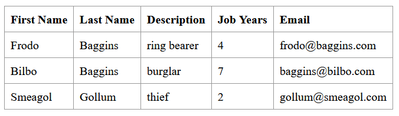

DevOps Technical Report | Class Assignment 2 - Part 2
====================================

Table of Contents
-----------------


### Introduction
In this section of the assignment, we will be transitioning from Maven to Gradle for the basic version of the Tutorial application.
This will involve creating a new branch in the repository named tut-basic-gradle, which will be used exclusively for this part of the assignment.

### Requirements
1. Create a new branch in your repository named tut-basic-gradle.
2. Start a new gradle spring boot project with the following dependencies: Rest Repositories, Thymeleaf, JPA and H2.
3. Extract the generated zip file into the folder "CA2/part2" of your repository. Then, check  the available gradle tasks.
4. Delete the src folder, and copy the src folder from the basic folder of the tutorial into the new folder.
   a. Copy the files webpack.config.js and package.json;
   b. Delete the folder src/main/resources/static/built/;
5. Add the gradle plugin org.siouan.frontend to the project.
6. Add "org.siouan.frontend-jdk17" version "8.0.0"
7. Configure the plugin in build.gradle.
8. Update the scripts section in package.json to configure the execution of webpack.
9. Add a task to gradle to copy the generated jar.
10. Add a task to gradle to delete all the files generated by webpack.

### Analysis
1. **Create a new branch**: Create a new branch named tut-basic-gradle. 
It ensures that the changes made during the conversion process do not affect the main branch of the project.

2. **Start a new gradle spring boot project**: Start new project with the following dependencies: Rest Repositories, Thymeleaf, JPA and H2.
The specified dependencies are for creating RESTful APIs, rendering server-side HTML views, persisting data using Java Persistence API (JPA), and using H2 as an in-memory database.

3. **Extract the generated zip file**: extract the zip file into the folder "CA2/part2" of your repository. Then, check the available gradle tasks.
This step involves extracting the project files from the generated zip file and checking the available Gradle tasks. This helps to understand the build lifecycle of the new Gradle project.

4. **Add the gradle plugin**: add the pulgin org.siouan.frontend to the project.
This step involves adding a Gradle plugin that provides tasks to handle frontend resources in a Java project. This plugin can install Node.js and npm, and run npm and npx commands.

5. **Add "org.siouan.frontend-jdk17" version "8.0.0"**: This step involves specifying the version of the frontend plugin to use. The version "8.0.0" is compatible with JDK 17.

6. **Configure the plugin in build.gradle**: This step involves configuring the frontend plugin in the build.gradle file.
This could include specifying the Node.js version to use, the npm version, and the scripts to run.

7. **Update the scripts section in package.json**: update the scripts to configure the execution of webpack.
This step involves configuring webpack, a static module bundler for JavaScript applications, in the package.json file.

8. **Add a task to gradle to copy the generated jar**:
This step involves adding a Gradle task to copy the generated JAR file to a specified location. This can be useful for deployment or distribution purposes.

9. **Add a task to gradle to delete all the files generated by webpack**:
This step involves adding a Gradle task to clean up the files generated by webpack. This can be useful to ensure a clean state before building the project.

### Implementation

Let's start by implementing the requirements for converting the basic version of the Tutorial application to Gradle. We will follow the steps outlined in the requirements and provide a detailed explanation for each step.

1. Create a new branch in your repository named tut-basic-gradle and navigate to that branch.

```bash
git branch tut-basic-gradle
git checkout tut-basic-gradle
```

2. Start a new Gradle Spring Boot project with the specified dependencies. Use https://start.spring.io/ to generate the project with the following dependencies:
* Rest Repositories
* Thymeleaf
* JPA
* H2

3. Extract the generated zip file into the folder "CA2/part2" of your repository. Then, check the available Gradle tasks.

4. Check the available gradle tasks:

```bash
./gradlew tasks
```

5. Delete the src folder.

```bash
cd CA2/part2
rm -rf src
```

6. Copy the src folder from the basic folder of the tutorial into the new folder.

```bash
cp -r path/to/basic/src CA2/part2
```

7. Copy the webpack.config.js

```bash
cp ../../ca1/basic/webpack.config.js CA2/part2
```

8. Copy the package.json

```bash
cp ../../ca1/basic/package.json CA2/part2
```

9. Delete the folder src/main/resources/static/built/

```bash
rm -rf src/main/resources/static/built
```

10. Before running the application you have to do the following changes:

* In the class Employee.java change the following imports, where is used javax. change to:

```java
import java.util.Objects;

import jakarta.persistence.Entity;
import jakarta.persistence.GeneratedValue;
import jakarta.persistence.Id;
```

* In the build.gradle file, add the following plugin dependencies:

```gradle
plugins {
    id 'java'
    id 'org.springframework.boot' version '3.2.4'
    id 'io.spring.dependency-management' version '1.1.4'
    id "org.siouan.frontend-jdk17" version "8.0.0"
    id 'com.github.node-gradle.node' version '3.1.1'
}
```

* Add the following configuration in the package.json file, before the scripts:

```json
  "packageManager": "npm@9.6.7",
```

Now run the application:

```bash
./gradlew bootRun
```

* Commit and push the changes.

```bash
git add .
git commit -m "new: extracted spring application to CA2/part2 directory and ran it - closes #16"
git push
``` 

11. In order to configure the plugin in build.gradle, add the following configuration:

```gradle
frontend {
	nodeVersion = "16.20.2"
	assembleScript = "run build"
	cleanScript = "run clean"
	checkScript = "run check"
}
```

12. Update the scripts section in package.json to configure the execution of webpack.

```json
 "scripts": {
    "webpack": "webpack",
    "build": "npm run webpack",
    "check": "echo Checking frontend",
    "clean": "echo Cleaning frontend",
    "lint": "echo Linting frontend",
    "test": "echo Testing frontend"
  }
```

* Commit and push the changes.

```bash
git add package.json
git add build.gradle
git commit -m "new: added frontend plugin and ran application - closes #17"
git push 
```

13. Now you can build the project, and the run the application using the following commands:

```bash
./gradlew build
./gradlew bootRun
```

Here is the frontend of the application:



14. Add a task to Gradle to copy the generated jar into a folder named "dist" located at the project root folder level.

```gradle 
task copyJar(type: Copy) {
	dependsOn build

	from 'build/libs'
	into 'dist'

	include '**/*.jar'
}
```
* Commit and push the changes.

```bash
git add build.gradle
git commit -m "new: added task to build.gradle to copy jar file - closes #18"
git push  
```

15. Add a task to Gradle to delete all the files generated by webpack.

```gradle
task cleanWebpack(type: Delete) {
	delete 'src/main/resources/static/built'
}

clean.dependsOn cleanWebpack
```
* Commit and push the changes.
```bash 
git add build.gradle
git commit -m "new: added task to clean files generated by webpack - closes #19"
git push 
```

16. Close the branch and merge to the main branch.

```bash 
git checkout main
git merge --no-ff tut-basic-gradle 
```

17. Mark the repository with the tag ca2-part2.

```bash
git tag ca2-part2
git push origin ca2-part2
```

### Conclusion

In this report, we effectively migrated the Tutorial application from Maven to Gradle, following a structured process.
We created a new branch, initialized a Spring Boot project with Gradle, and replaced Maven-specific configurations with Gradle equivalents. By adding necessary plugins and tasks, we ensured smooth execution and management of the project. 
