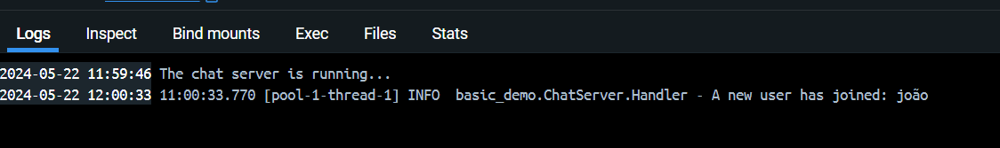
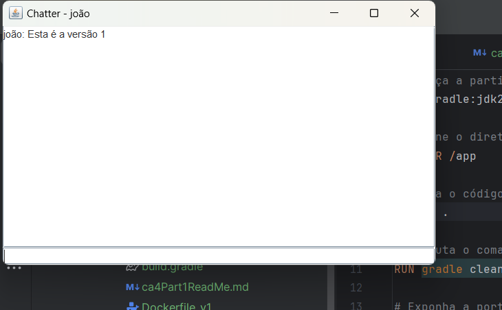
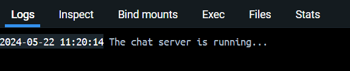
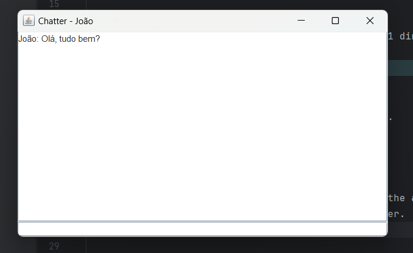

# DevOps Technical Report | Class Assignment 4 - Part 1

## Part 1 - Containers with Docker

### Introduction
The purpose of this class assignment is to demonstrate the use of Docker containers. Docker is a platform that allows developers to develop, ship, and run applications in containers. 
The main goal is to execute the chat server in a container and connect to it from the host machine.

### Requirements
1. Clone the directory of CA2 part1 to the CA4 part1 directory.
2. Create a docker image to execute the chat server.
3. Tag the image and publish it in docker hub.
4. Run the client side in your host machine.
5. Mark your repository with the tag ca4-part1.

### Versions
1. Version 1: In this version you should build the chat server "inside" the Dockerfile.
2. Version 2: In this version you should build the chat server in your host computer and copy the jar file "into" the Dockerfile.

### Implementation
1. Clone the directory of CA2 part1 to the CA4 part1 directory.
```bash
mkdir -p ca4/part1
cp -r ca2/part1/* ca4/part1
```
#### Version 1

2. Create a docker image to build the chat server inside the DockerFile.
```dockerfile
# Start from a Java image.
FROM gradle:jdk21

# Set the working directory.
WORKDIR /app

# Copy the jar file into the Docker image.
COPY . .

# Build the application.
RUN gradle clean build

# Expose the port.
EXPOSE 59001

# Run the jar file and the runServer task.
CMD ["sh", "-c", "java -jar build/libs/*.jar & gradle runServer"]
```
3. Build the Dockerfile
```bash
docker build -f Dockerfile_v1 -t ca4-part1.1 . 
```
4. Run the Dockerfile
```bash
 docker run -d -p 59001:59001 ca4-part1.1
```
5. Run the client side in your host machine
```bash
gradle runClient
```
* Server running Version 1


* Chat running Version 1


6. Tag the image and publish it in docker hub
* Login in Docker
```bash
docker login
```

* Tag the image
```bash
docker tag ca4-part1.1 sabesquemeoboda/ca4-part1.1
```
* Push the image
```bash
docker push sabesquemeoboda/ca4-part1.1
```
* Now the image is available in here:
  https://hub.docker.com/u/sabesquemeoboda


#### Version 2
1. Create the Version 2:

```dockerfile
# Start from a Java image.
FROM gradle:jdk21

# Set the working directory.
WORKDIR /app

# Copy the jar file into the Docker image.
COPY build/libs/basic_demo-0.1.0.jar .

# Expose the port.
EXPOSE 59001

# Run the jar file.
ENTRYPOINT ["java", "-cp", "basic_demo-0.1.0.jar", "basic_demo.ChatServerApp", "59001"]
```

2. Build the Dockerfile
```bash
docker build -f Dockerfile_v2 -t ca4-part1.2 .
```

3. Run the Dockerfile
```bash
docker run -d -p 59001:59001 ca4-part1.2
```

4. Run the client side in your host machine
```bash
gradle runClient
```

* Image of the running server in the container:



* Image of the running chat:



### Conclusion
In this assignment, we learned how to create a Docker image to run a chat server and 
connect to it from the host machine. We created two versions of the Dockerfile, 
one that builds the chat server inside the Dockerfile and another that copies the jar file into 
the Dockerfile.
We also published the image in Docker Hub.