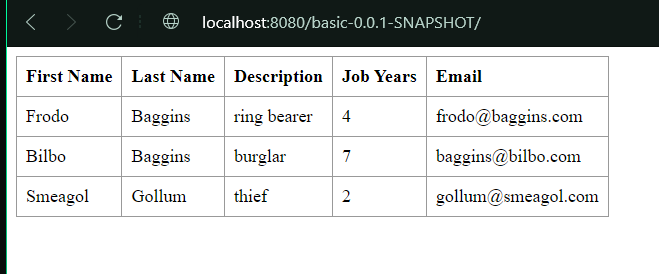
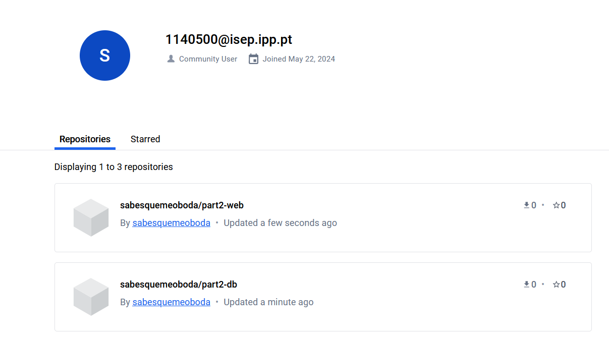

# DevOps Technical Report | Class Assignment 4 - Part 2

## Part 2 - Containers with Docker

### Introduction
The goal of this assignment is to use Docker to set up a containerized environment to execute our version of the gradle version of the spring basic tutorial application.

### Requirements
1. Use docker-compose to produce two containers:
 * web: This container is used to run Tomcat and spring application.
 * db: This container is used to execute H2 server database.
2. Publish the images (db and web) to Docker Hub.
3. Use a volume with db container to get a copy of the database file by using the exec to run a shell in the container and copying the database file to the volume.
4. Include all the Docker files in the repository.
5. Tag the repository with the tag ca4-part2.

### Implementation
1. Clone the directory of CA2 part2 to the CA4 part2 directory.
```bash
mkdir -p ca4/part2
cp -r ca2/part2/* ca4/part2
```

2. Create a Dockerfile for the database container.
```dockerfile
FROM ubuntu:focal

RUN apt-get update && \
    apt-get install -y wget openjdk-21-jdk-headless && \
    rm -rf /var/lib/apt/lists/* \

WORKDIR /opt/h2

RUN wget https://repo1.maven.org/maven2/com/h2database/h2/1.4.200/h2-1.4.200.jar -O h2.jar

EXPOSE 8082

EXPOSE 9092

CMD ["java", "-cp", "h2.jar", "org.h2.tools.Server", "-ifNotExists", "-web", "-webAllowOthers", "-webPort", "8082", "-tcp", "-tcpAllowOthers", "-tcpPort", "9092"]
```
3. Create a Dockerfile for the web container.
```dockerfile
# Use a base image with Java
FROM gradle:jdk21 as builder

# Set the working directory
WORKDIR /app

# Copy the project into the Docker image
COPY . /app

# Build the Spring Boot application
RUN gradle build

# Start a new stage to create a smaller image
FROM openjdk:21

# Set the working directory
WORKDIR /app

# Copy the built .jar file from the builder stage
COPY --from=builder /app/build/libs/*.jar /app

# Expose the port the application runs on
EXPOSE 8080

# Run the application
CMD ["java", "-jar", "/app/react-and-spring-data-rest-basic-0.0.1-SNAPSHOT.jar"]
```

4. Create a docker-compose.yml file to define the services.
```yaml
services:
  db:
    build:
      context: .
      dockerfile: Dockerfile_db
    container_name: h2-db
    ports:
      - "8082:8082"
      - "9092:9092"
    volumes:
      - h2-data:/opt/h2-data

  web:
    build:
      context: .
      dockerfile: Dockerfile_web
    container_name: spring-web
    ports:
      - "8080:8080"
    depends_on:
      - db

volumes:
  h2-data:
    driver: local
```

5. Change the application.properties file to use the host machine IP address.
```properties
spring.datasource.url=jdbc:h2:tcp://<yourIP>:9092/./jpadb;DB_CLOSE_DELAY=-1;DB_CLOSE_ON_EXIT=FALSE
```

6. Build the images and run the containers.
```bash
docker-compose up 
```
 

 
 
7. Publish the images to Docker Hub.
* Web image
  * Login in Docker
    ```bash
    docker login
    ```
    * Tag the image
    ```bash
    docker tag part2-web sabesquemeoboda/part2-web
    ```
  * Push the image
    ```bash
    docker push sabesquemeoboda/part2-web
    ```
  * Now the image is available in here:
    https://hub.docker.com/u/sabesquemeoboda

* DB image
  * Login in Docker
    ```bash
    docker login
    ```

  * Tag the image
    ```bash
    docker tag part2-db sabesquemeoboda/part2-db
    ```
  * Push the image
    ```bash
    docker push sabesquemeoboda/part2-db
    ```

* Now the image is available in here:
  https://hub.docker.com/u/sabesquemeoboda



8. Use a volume with db container to get a copy of the database file by using the exec to run a shell in the container and copying the database file to the volume. 
To achieve this, update the database Dockerfile to use the volume correctly:
```dockerfile
FROM ubuntu:focal

RUN apt-get update && \
    apt-get install -y wget openjdk-21-jdk-headless && \
    rm -rf /var/lib/apt/lists/*

WORKDIR /opt/h2

RUN wget https://repo1.maven.org/maven2/com/h2database/h2/1.4.200/h2-1.4.200.jar -O h2.jar

# Ensure the data directory exists
RUN mkdir -p /opt/h2-data

# Expose the data directory as a volume
VOLUME /opt/h2-data

EXPOSE 8082
EXPOSE 9092

CMD ["java", "-cp", "h2.jar", "org.h2.tools.Server", "-ifNotExists", "-web", "-webAllowOthers", "-webPort", "8082", "-tcp", "-tcpAllowOthers", "-tcpPort", "9092", "-baseDir", "/opt/h2-data"]
```

* The ```VOLUME /opt/h2-data``` instruction indicates that this directory should be a volume.
* The ```CMD``` instruction includes ```-baseDir /opt/h2-data``` to ensure the H2 database uses this directory for storage.

Start the services:
``` bash
docker-compose up -d
```
Run a shell inside the database container:
```bash
docker exec -it h2-db bash
```
Due to the settings used in the Dockerfile, the database file will be stored in the /opt/h2-data directory. To verify this, run the following command:
```bash
cd /opt/h2-data
ls
```
The output should show the database file:


9. Use the following command to go back to the host machine:
```bash
exit
```

10. Tag the repository with the tag ca4-part2.
```bash
git tag ca4-part2
git push origin ca4-part2
```
### Conclusion
In this assignment, we successfully set up a containerized environment using Docker to run a Gradle-based Spring application with an H2 database.

Additionally, we can guarantee that Docker ensures that the application runs consistently across different environments by encapsulating its containers. This will reduce conflicts and simplifies dependency management.