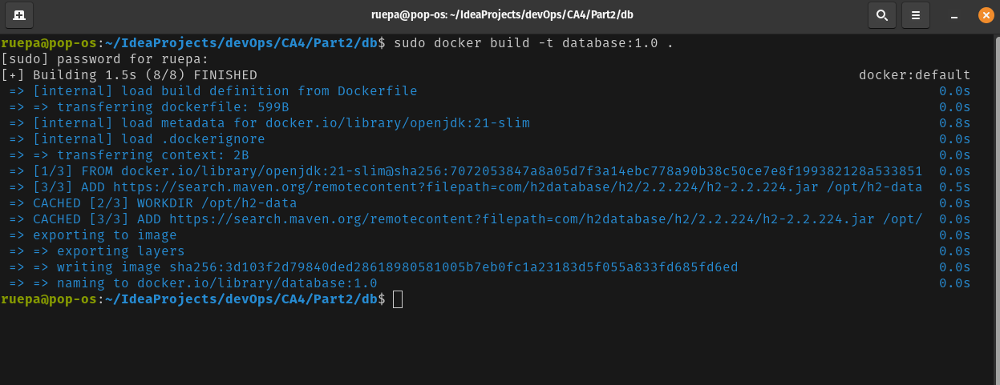
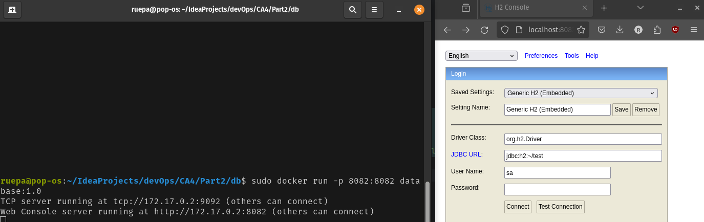
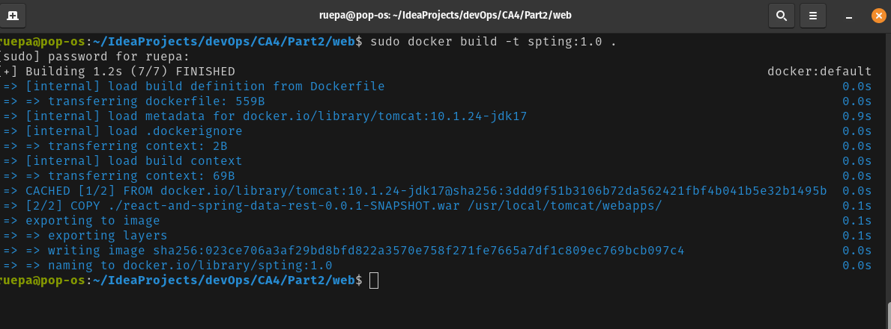
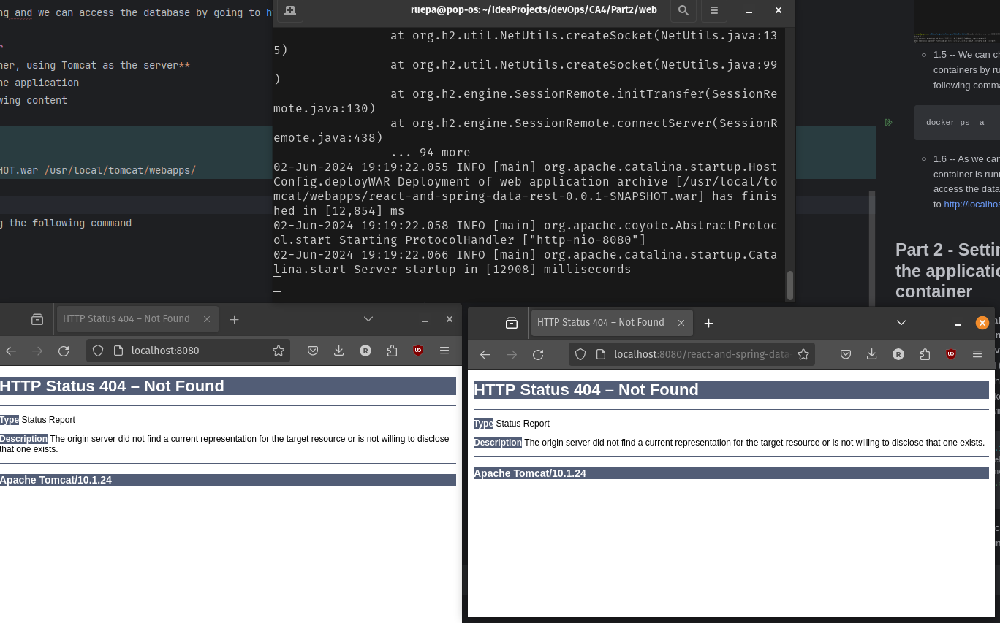
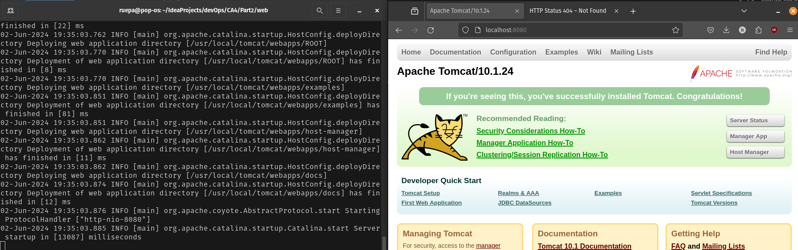
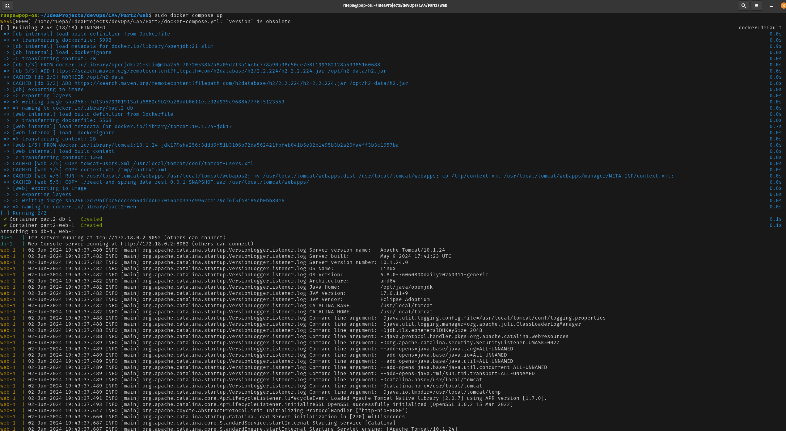
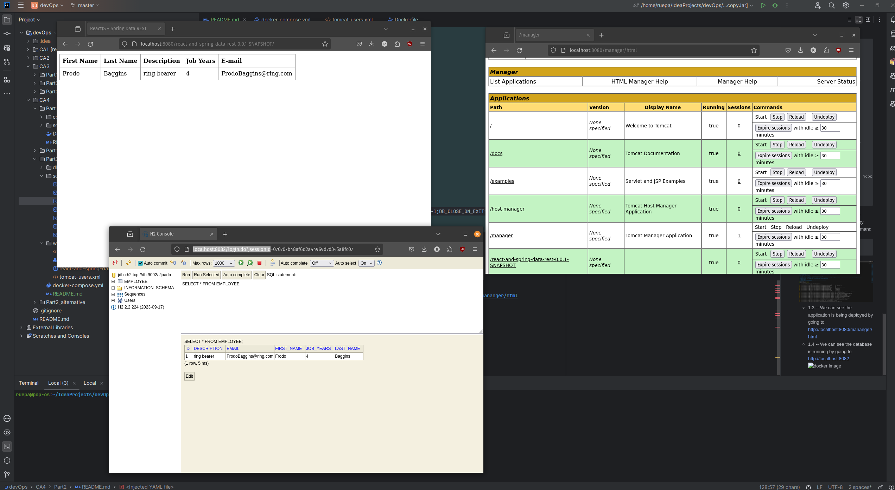
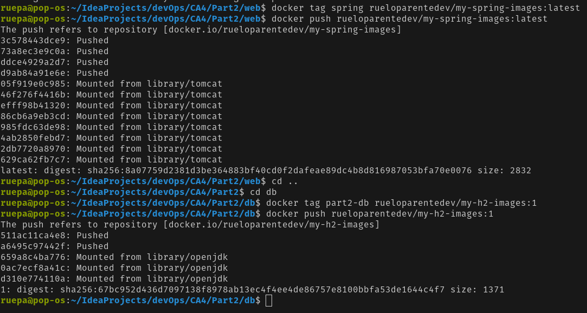

# Technical report for forth assignment - Part 2
#### Here we will practice with docker compose, running an application on a container and connecting to a database running on another container
#### A more technical explanation of the commands used can be found in the end of the README


## Part 0
- 1 - **First we will decide on our project structure**
  - 1.1 -- On the root folder we will have the following structure:
  ```bash
    .
    ├── db
    │   ├── Dockerfile
    │   └── h2-2.2.224.jar
    ├── web
    │   ├── Dockerfile
    │   ├── react-and-spring-data-rest-0.0.1-SNAPSHOT.war
    ├── docker-compose.yml
    ```
    - 1.2 -- The db folder will contain the database container
    - 1.3 -- The web folder will contain the application container
    - 1.4 -- The docker-compose.yml will contain the configuration for both containers


## Part 1 - Setting up the database container
- 1 - **First we will create the database container**
  - 1.1 -- First we need to create a Dockerfile for the database
  - 1.2 -- The Dockerfile should have the following content
  ```Dockerfile
  FROM openjdk:21-slim
  WORKDIR /opt/h2-data
  COPY ./h2-2.2.224.jar /opt/h2-data/h2.jar
  CMD ["java", "-cp", "/opt/h2-data/h2.jar", "org.h2.tools.Server", "-web", "-webAllowOthers", "-webPort", "8082", "-tcp", "-tcpAllowOthers", "-tcpPort", "9092", "-ifNotExists"]
  ```
  - 1.3 -- Now we can build the image by running the following command
  ```bash
  docker build -t database .
  ```
  
  - 1.4 -- Now we can run the image by running the following command
  ```bash
  docker run -p 8082:8082 database
  ```
  
  - 1.5 -- We can check the running containers by running the following command
  ```bash
  docker ps -a
  ```
  - 1.6 -- As we can see the container is running and we can access the database by going to http://localhost:8082

## Part 2 - Setting up the application container
- 1 - **Now we will make the application container, using Tomcat as the server**
  - 1.1 -- We need to create a Dockerfile for the application
  - 1.2 -- The Dockerfile should have the following content
  ```Dockerfile
  FROM tomcat:10.1.24-jdk17
  WORKDIR /opt/web
  COPY ./react-and-spring-data-rest-0.0.1-SNAPSHOT.war /usr/local/tomcat/webapps/
  CMD ["catalina.sh", "run"]
  ```
  - 1.3 -- Now we can build the image by running the following command
  ```bash
  docker build -t spring .
  ```
  
  - 1.4 -- Now we can run the image by running the following command
  ```bash
  docker run -p 8080:8080 spring
  ```
  
  - 1.5 -- We can see that the application is not running, but the container appears to be up
  - 1.5 -- We can check the running containers by running the following command
  ```bash
  docker ps -a
  ```
  - 1.6 -- As we can see the container is running
- 2 - **Fixing the tomcat image**
  - 2.1 -- Upon further inspection we can see that the application is not running due to tomcat blocking webapps by default
  - 2.2 -- We need to change the permissions of the webapps folder
  - 2.3 -- We will also add the context.xml and user.xml files to the webapps/manager/META-INF folder
  - 2.4 -- We can do this by adding the following line to the Dockerfile
  ```Dockerfile
    COPY tomcat-users.xml $CATALINA_HOME/conf/tomcat-users.xml
    COPY context.xml /tmp/context.xml
    RUN mv /usr/local/tomcat/webapps /usr/local/tomcat/webapps2; mv /usr/local/tomcat/webapps.dist /usr/local/tomcat/webapps; 
    cp /tmp/context.xml /usr/local/tomcat/webapps/manager/META-INF/context.xml;
    ```
    - 2.5 -- Now we can build the image by running the following command
    - 2.6 -- Now we can run the image by running the following command
    ```bash
    docker build -t spring .
    docker run -p 8080:8080 spring
    ```
    
  - 2.7 -- The application is still not running as it tries to connect to the database on localhost
  - 2.8 -- We need to change the application.properties file to connect to the database container
  - 2.9 -- We can do this by adding the following line to the application.properties file
  - 2.10 -- We will do that in the next section when we create the docker-compose.yml file
  - 2.11 -- We can see the application is being deployed by going to http://localhost:8080/mananger/html
  ![docker image](screenshots/tomcatManager.png0

## Part 3 - Setting up the docker-compose.yml file
- 1 - **Now we will create the docker-compose.yml file**
  - 1.1 -- The docker-compose.yml file should have the following content
  ```yml
  version: '3.8'

  services:
  db:
  build:
  context: db
  dockerfile: ./Dockerfile
  ports:
  - "8082:8082"
  - "9092:9092"
    volumes:
    - h2-data:/var/lib/h2
  
 
  web:
  build:
  context: web
  dockerfile: ./Dockerfile
  ports:
  - "8080:8080"
  depends_on:
    - db
    environment:
    SPRING_DATASOURCE_URL: jdbc:h2:tcp://db:9092/./jpadb;DB_CLOSE_DELAY=-1;DB_CLOSE_ON_EXIT=FALSE
  
  volumes:
  h2-data:
  ```
  - 1.2 -- Now we can run the docker-compose.yml file by running the following command
  - 1.3 -- We need to set the environment variable to connect to the database container
  ```bash
  sudo docker command up
  ```
  
  - 1.3 -- We can see the application is being deployed by going to http://localhost:8080/mananger/html
  - 1.4 -- We can see the database is running by going to http://localhost:8082
  
  
## Part 4 - Publishing the images to docker hub
- 1 - **Now we will publish the images to docker hub**
  - 1.1 -- First we need to login to docker hub by running the following command
  ```bash
  docker login
  ```
  - 1.2 -- Now we can tag the images by running the following command
  ```bash
  docker tag database rueloparentedev/my-h2-images:latest
  docker tag spring rueloparentedev/my-spring-images:1.0
  ```
  - 1.3 -- Now we can push the images by running the following command
  ```bash
  docker push rueloparentedev/my-h2-images:latest
  docker push rueloparentedev/my-spring-images:1.0
  ```
  - 1.4 -- The images are now available on docker hub
  - 1.5 -- We can pull the images by running the following command
  ```bash
    docker pull rueloparentedev/database:latest
    docker pull rueloparentedev/spring:1.0
    ```
  
## Part 5 - Getting a copy of the database volume
- 1 - **Now we will get a copy of the database volume**
  - 1.1 -- First we need to get the volume id by running the following command
  ```bash
  docker volume ls
  ```
  - 1.2 -- Now we can copy the volume by running the following command
  ```bash
  docker run -v part2_h2-data:/volume -v $(pwd):/backup --rm alpine ash -c "cd /volume && tar -cvf /backup/backup.tar ."
  ```
  - 1.3 -- Now we can extract the volume by running the following command
  ```bash
  tar -xvf backup.tar
  ```
  - 1.4 -- We now have a copy of the database volume
  
- 2 -**Alternative we can copy only the database file**
    - 2.1 -- First we need to get the container id by running the following command
    ```bash
    docker ps -a
    docker exec -it part2-db-1 sh
    pwd
    ```
    - 2.2 -- Now we can copy the database file by running the following command
    ```bash
    sudo docker cp part2-db-1:/opt/h2-data/jpadb.mv.db ./db_backup/jpadb.mv.db
    ```
    - 2.3 -- We now have a copy of the database file
- 3 -- Alternative copy between volumes
    - 3.1 -- First we need to get the container id by running the following command
    ```bash
    docker ps -a
    docker exec -it part2-db-1 cp opt/h2-data/jpadb.mv.db /backup/jpadb.mv.db
    ```
    
## Part 6 - Technical Explanation of Commands and Concepts

This section delves into the technical aspects of the Docker commands and concepts used in this project, providing a deeper understanding of their functionality and significance.

### Docker Commands

* **`docker build -t <image_name> .`**
  * **Purpose:** Builds a Docker image from a Dockerfile.
  * **Explanation:**
    * `-t <image_name>`:  Assigns a name to the image for easy reference.
    * `.`: Specifies the build context, which is the current directory containing the Dockerfile.
  * **Example:** `docker build -t database .` builds an image named "database" using the Dockerfile in the current directory.
* **`docker run -p <host_port>:<container_port> <image_name>`**
  * **Purpose:** Creates and starts a container from a Docker image.
  * **Explanation:**
    * `-p <host_port>:<container_port>`:  Publishes a container port to the host machine, enabling access to the application running inside.
    * `<image_name>`: The name of the image to use for creating the container.
  * **Example:** `docker run -p 8082:8082 database` starts a container from the "database" image and maps port 8082 inside the container to port 8082 on the host.
* **`docker ps -a`**
  * **Purpose:** Lists all containers, including stopped ones.
  * **Explanation:**
    * `-a`: Shows all containers (running and stopped).
* **`docker exec -it <container_id> sh`**
  * **Purpose:** Executes a command inside a running container.
  * **Explanation:**
    * `-it`:  Provides an interactive terminal session within the container.
    * `<container_id>`:  Identifies the container to execute the command in.
    * `sh`:  Starts a shell session inside the container.
* **`docker cp <container_id>:<source_path> <destination_path>`**
  * **Purpose:** Copies files or folders between a container and the host machine.
  * **Explanation:**
    * `<container_id>`:  The ID of the container to copy from or to.
    * `<source_path>`: The path to the file or folder inside the container.
    * `<destination_path>`: The path on the host machine where the file or folder should be copied.
* **`docker volume ls`**
  * **Purpose:** Lists all Docker volumes.
  * **Explanation:**
    * Volumes are used to persist data outside the container's lifecycle.
* **`docker run -v <volume_name>:/volume -v $(pwd):/backup --rm alpine ash -c "<command>"`**
  * **Purpose:** Backs up a Docker volume to the host machine.
  * **Explanation:**
    * `-v <volume_name>:/volume`: Mounts the specified volume to `/volume` inside the container.
    * `-v $(pwd):/backup`: Mounts the current working directory on the host to `/backup` inside the container.
    * `--rm`: Automatically removes the container after it exits.
    * `alpine`:  Uses a minimal Alpine Linux image, ideal for scripting and backups.
    * `ash -c "<command>"`: Executes a command inside the container using the Alpine shell.  In this case, `cd /volume && tar -cvf /backup/backup.tar .` creates a compressed tar archive of the volume's contents.
* **`docker login`**
  * **Purpose:** Logs into a Docker registry (e.g., Docker Hub).
* **`docker tag <image_name> <registry_username>/<repository_name>:<tag>`**
  * **Purpose:** Tags an image for pushing to a registry.
* **`docker push <registry_username>/<repository_name>:<tag>`**
  * **Purpose:**  Uploads an image to a Docker registry.


### Technical Deep Dive

* **Docker Compose (docker-compose.yml):**
  * **Purpose:** Defines and manages multi-container Docker applications.
  * **Advantages:**
    * **Simplified Configuration:**  Describes the services (containers), networks, and volumes of your application in a single YAML file.
    * **Single-Command Deployment:** `docker-compose up` starts, connects, and configures all containers as defined in the file.
    * **Environment Variables:**  Allows you to define environment variables specific to each service, like the database connection string.
* **Networking in Docker Compose:**
  * **Default Network:** Docker Compose creates a default network for your application.  Containers within this network can communicate with each other using their service names as hostnames. For instance, the `web` container can connect to the database using `db:9092`.
* **Persistence with Docker Volumes:**
  * **Data Persistence:**  Docker volumes provide a mechanism for storing data generated by a container outside of the container's writable layer.
  * **Benefits:**
    * **Data Preservation:** Data in volumes persists even if the container is stopped, deleted, or recreated.
    * **Data Sharing:** Volumes can be shared between containers.

In summary, this technical report has provided a comprehensive overview of the Docker Compose project, explaining not only the steps taken but also the reasoning and technical details behind those choices. This knowledge is essential for effectively using Docker to build, deploy, and manage containerized applications. 


## Part 7 - Docker vs. Kubernetes or Docker and Kubernetes?

This section will clarify the relationship between Docker and Kubernetes and explain when to use one, the other, or both:

**Docker:**

* **Focus:** Containerization. Docker provides the tools to package, distribute, and run applications in isolated environments (containers).
* **Strengths:**
  * **Simplicity and Ease of Use:** Docker is relatively straightforward to learn and use, making it suitable for single-host deployments and development environments.
  * **Portability:** Docker containers run consistently across different environments (development, testing, production), simplifying deployment workflows.
  * **Image Management:**  Docker Hub and other registries provide easy sharing and version control of container images.

**Kubernetes:**

* **Focus:** Container orchestration. Kubernetes manages and automates the deployment, scaling, networking, and health of containerized applications, particularly in large, distributed environments.
* **Strengths:**
  * **Scalability and High Availability:**  Kubernetes can scale applications horizontally (adding more container instances) to handle increased load and provide high availability.
  * **Self-Healing:** Kubernetes automatically restarts, reschedules, and replicates containers to maintain application health and resilience.
  * **Service Discovery and Load Balancing:** Kubernetes provides mechanisms for service discovery (finding other services within the cluster) and load balancing (distributing traffic across container instances).

**Docker and Kubernetes: A Powerful Combination**

Docker and Kubernetes are often used together:

* Docker provides the containerization technology, packaging applications into portable units.
* Kubernetes orchestrates those containers, managing their deployment, scaling, and operations.

**When to Use Docker, Kubernetes, or Both:**

* **Use Docker Alone:**
  * For local development and testing.
  * For deploying simple applications to a single server or virtual machine.
  * To package and share applications as container images.

* **Use Docker with Kubernetes:**
  * For deploying complex applications with multiple microservices.
  * For deploying applications that need to scale dynamically.
  * For deploying applications to a cloud environment where infrastructure can be provisioned and managed automatically.

* **Use Kubernetes without Docker (Less Common):**
  * While Kubernetes was designed to work with Docker, it can also manage other container runtimes (like containerd, CRI-O). This approach offers more flexibility and control over the container runtime but is less common.

In this project, Docker Compose was suitable for running the multi-container application locally. However, for production deployments, especially those requiring high scalability and availability, using Docker with Kubernetes would be a more robust and manageable solution.

